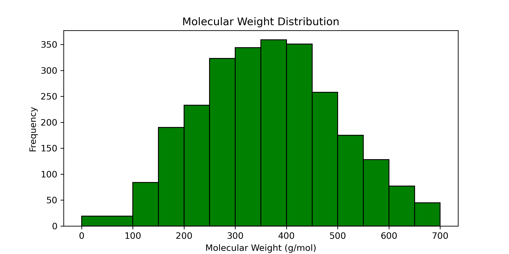

# Molecular Descriptor Stat Analysis Tools

This Python command calculates various molecular descriptors for a given set of molecules from an SDF file and plots the molecular weight distribution.

## Features

- Calculate TPSA (Topological Polar Surface Area)
- Calculate LogP (Molecular LogP)
- Calculate Molecular Weight (MW)
- Calculate Hydrogen Bond Donors (HBD)
- Calculate Hydrogen Bond Acceptors (HBA)
- Plot the distribution of molecular weights

## Requirements

- RDKit: A collection of cheminformatics and machine-learning tools
- NumPy: The fundamental package for scientific computing with Python
- Matplotlib: A plotting library for the Python programming language

## Installation

To install the required packages, run:

```bash
pip install molstat 
```

## Usage

Run the script with an SDF file as an argument:

```bash
molstat  your_file.sdf
```


The script will generate a plot of the molecular weight distribution and save it as a PNG file with the name structure: `MW<basename>.png`, where `<basename>` is the name of the input file without the extension.


```bash
molstat  -f tSNE file1.sdf file2.sdf file3.sdf
```


The script will generate a plot of the chemical space.


## Example

To analyze a file named `test.sdf`, you would run:

```bash
molstat test.sdf
```

This will generate a plot named `MWtest.png`.

## License

[MIT License](LICENSE)

## Contact

For any questions or issues, please contact zqchen_simm@qq.com .
